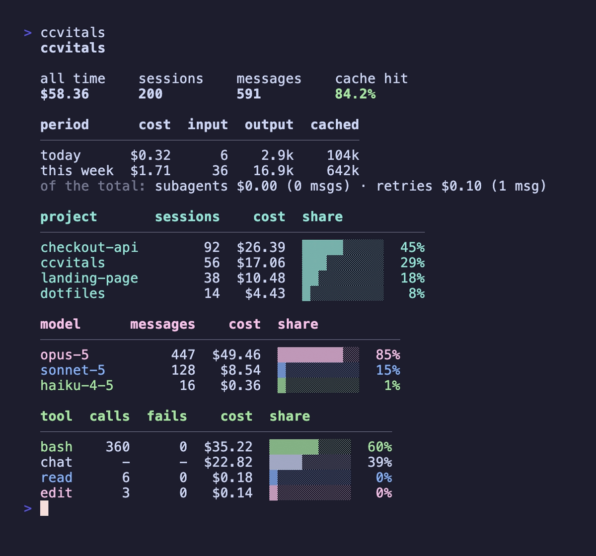
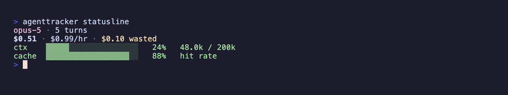

# ccplus

Where your Claude Code money went.

Claude Code already writes a log for every session. ccplus just reads them.
Nothing is sent anywhere, nothing is written outside its own install, no config
file. Uninstall it and there is no trace left.



```bash
npx ccplus              # try it
npm install -g ccplus   # keep it
```

Needs Node 20 or newer.

## The commands

While a session is running:

| | |
| --- | --- |
| `ccplus statusline` | a panel for Claude Code's status line |
| `ccplus context` | what is filling the context window |

Afterwards:

| | |
| --- | --- |
| `ccplus` | where the money went, today and this week |
| `ccplus sessions` | recent sessions with cost, duration, and turns |
| `ccplus doctor` | anything it could not parse or price |

## Context

Your status line says the window is 91% gone. This says what took it.


What you are hunting for is a file read many times over. Each read puts the
same bytes in the window again, and the count on the right makes that visible.

The fill and the startup line are exact. The split below them is estimated and
says so: every estimated number wears a `~`, and a footnote tells you how much
of the window the log could actually see. The
[design notes](docs/design.md) have the working.

## Dashboard and sessions

`ccplus` on its own gives the image at the top of this page: today and this
week, then totals by project, model and tool. `--span year` adds the
contribution graph: one square per day, tinted by whichever model spent the
most on it and brightening with how much. Piped or under `NO_COLOR`, where
brightness cannot say it, the squares become a shade ramp that can.

`ccplus sessions` lists them newest first. `--grep` searches what you typed
and shows the line that matched.

## Statusline

One row each for what is running, what it cost, how much context is left and
how much quota is left. **Wasted** is what you paid for retries and abandoned
branches. The **cache** share is usually the difference between a cheap
session and an expensive one.



```json
{ "statusLine": { "type": "command", "command": "ccplus statusline" } }
```

Goes in `~/.claude/settings.json`. If the bar comes up blank, use absolute
paths: a status line runs in a bare shell that may not know about your version
managed `node`. Rate limits need a Pro or Max plan.

## Flags

`--json` and `--no-color` work everywhere. `--project`, `--since` and `--until`
narrow the reports. The rest belong to one command each:

| | |
| --- | --- |
| `--span week\|month\|year` | dashboard |
| `--limit`, `--model`, `--grep` | `sessions` |
| `--window <tokens>` | `context` |
| `--ascii` | everywhere but `sessions`, which prints no glyphs |

Color never carries meaning on its own. It only repeats something a glyph, a
column or a heading already said, so `NO_COLOR`, `--no-color` and piping to a
file all read the same. Red means it failed and yellow wants your attention,
everywhere, and nothing else uses those two.

## When a number looks wrong

Start with `ccplus doctor`. A model with no price still gets its tokens
counted and its cost marked unknown rather than guessed at. Prices live in
`src/cost/pricing.json`, one file keyed by model. Pull requests adding a new
model are very welcome.

## License

MIT
